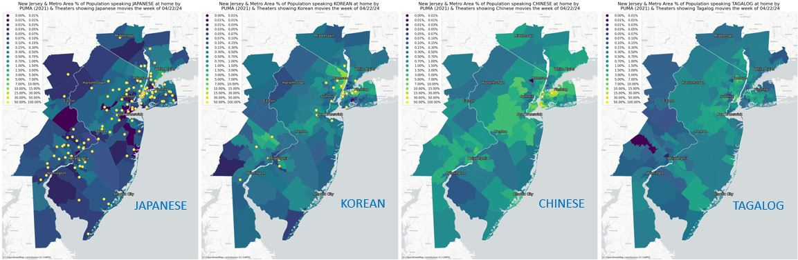
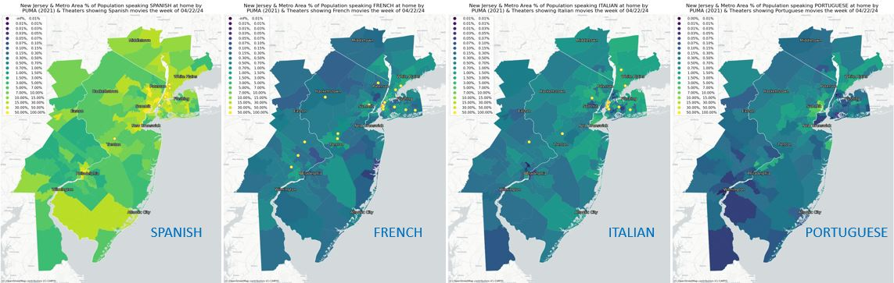

# Mapping Non-English Language Movie Theaters and Speakers

# 

The final version of my interactive map is available via Google drive (it was too large to upload on github):
https://drive.google.com/file/d/1ZBO3bXPVjO3kZ4ZLvsIY_1FLbu2CY2E-/view?usp=drive_link

An earlier version of my interactive map (missing the choropleth component outside of NJ, the popup info on PUMA exceptional language, and the draggable legend).
https://nclvt73.github.io/Command_line_GIS/Theaters_langs_folium_01.html

I originally thought of producing the following maps as small multiples, but then created them individually (in a loop).  However I juxtaposed them in Powerpoint to produce the first, small multiple, views (the individual maps follow).  Each of the maps shows the % of the population speaking the given language, by PUMA, as of 2021, with with lighter green & yellow indicating a higher concentration.  I used a common set of bins across all 12 maps to allow comaprison.  The yellow ots are movie theaters showing at least one film in the given language the week of 04/22/24.

#
Theaters_Hindi.png
