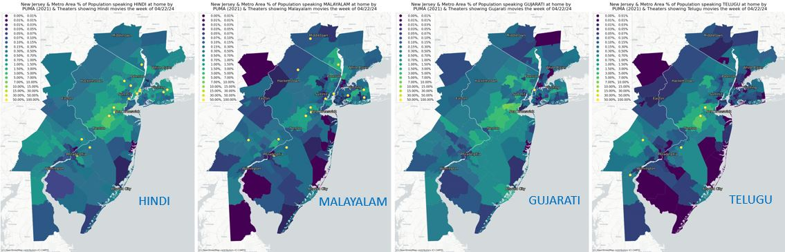

# Mapping Non-English Language Movie Theaters and Speakers

This project was produced as part of the course Command-line GIS with Professor Will Payne at the Bloustein School of Planning and Public Policy, Spring 2024 semester.

Since moving to Central New Jersey to go to Rutgers, I have been impressed by the cultural diversity present here.  The many cultures and nationalities comprising our community are reflected in the languages spoken here. One of the reflections of the languages spoken here is in the languages movies are shown in in theaters, a diverse offering which is apparent when you check the movie listings.  To explore this, I collected data on the languages of movies being shown across the state and in the adjacent metropolitan areas via web scraping of the movie listings on <a href="https://www.cinemaclock.com/"> CinemaClock.com </a> for the week of 04/22/24.
I then mapped the theaters along with two types of language-related data from the US Census Bureau: the percentage of the population that's foreign-born (from Census table B16005), available by census tract, and the percentage of the population speaking specific individual languages (from table B16001 via Social Explorer with assistance from  Professor Payne), available by PUMA: Public Use Microdata Area, areas containing roughly 100,000 people which may be the size of a county or of a neighborhood in an urban area.

My first map shows percentage foreign-born by census tract, across the state and Metro areas, as a choropleth map, with movie theaters showing Non-English movies indicated by blue dots of varying size, with the size based on the number of Non-English movies being shown at the time of data colection. Nine of the top eleven theaters by number of Non-English films being shown are labeled on the map.  Several of these top theaters are in the immediate vicinity of New Brunswick.

The final version of my interactive map was too large to upload to Github, so I'm ncluding the link to the file on Google drive here:
<a href="https://drive.google.com/file/d/1ZBO3bXPVjO3kZ4ZLvsIY_1FLbu2CY2E-/view?usp=drive_link"> Google drive link- final version </a>
Please download the html file and launch it on your PC.  

The interactive map contains markers for 256 theaters (including 46 closed theaters), with a backdrop choropleth map of Percent Foreign Born by census tract. Theaters are classified as showing more than one, or one or fewer, Non-English movies. Popup & tooltip (mouse-over) info for each theater includes (along with Theater Name and Address) the number of total and non-English language movies being shown at the theater and the list of languages with movies being shown for the week of 4/22/24.    Additionally, the popup for each theater includes the "PUMA Exceptional language": the language with the highest percentage of speakers relative to the US overall percentage of speakers, for the PUMA the theater is located in, along with the % comparison.  This info was calculated for each PUMA via Excel and then added to the theaters by spatial join.

An earlier version of my interactive map (missing the choropleth component outside of NJ, the popup info on PUMA exceptional language, and the draggable legend) ias here:
<a href="https://nclvt73.github.io/Command_line_GIS/Theaters_langs_folium_01.html"> Github link- initial version. </a>

# Language-Theater Maps

I originally thought of producing the following maps as small multiples, but then created them individually (via a loop).  However I juxtaposed them in Powerpoint to produce the first, small multiple, views (the individual maps follow).  Each of the maps shows the percentage of the population speaking the given language, by PUMA, as of 2021, with lighter green & yellow indicating a higher concentration.  I used a common set of bins across all 12 maps to allow comparison.  The yellow dots are movie theaters showing at least one film in the given language the week of 04/22/24.

For the 12 languages shown here, I chose a mix of languages that are among the most commonly spoken in New Jersey (such as Spanish &  Chinese), and languages that movies are commonly shown in, like Japanese and French.  Some, like Hindi and Korean fit both of these profiles.  Malayalam stands out as being one of the most popular languages for movies to be shown in despite a relatively less substantial portion of the population speaking it.  Gujarati, on the other hand, has a bigger population while only one movie is being shown in it (in Manhattan).  Spanish stands out for the degree to which its population dwarfs the other languages, yet only a few movies are being shown in it.  Japanese is the opposite case, with a huge number of movie showings and a small population (testament to the popularity of Japanese movies such as anime among non speakers). Portuguese and Tagalog are both fairly commonly spoken (in the Top 10), yet have no movie showings.  Chinese, the third most commonly spoken language after English & Spanish, has just a few movie showings.  The Top 15 languages from both sides are included below.

#

